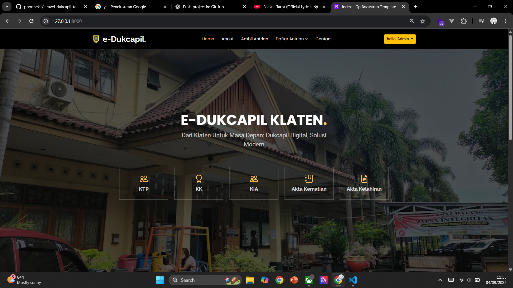
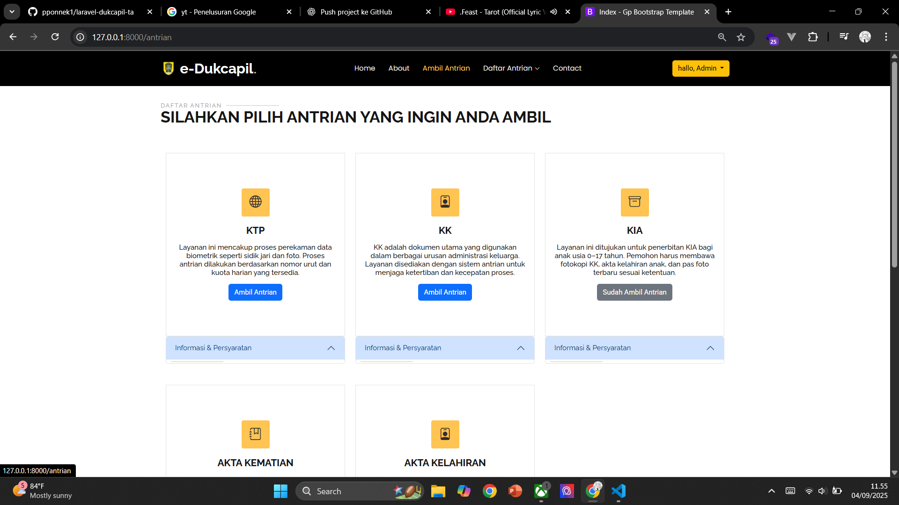
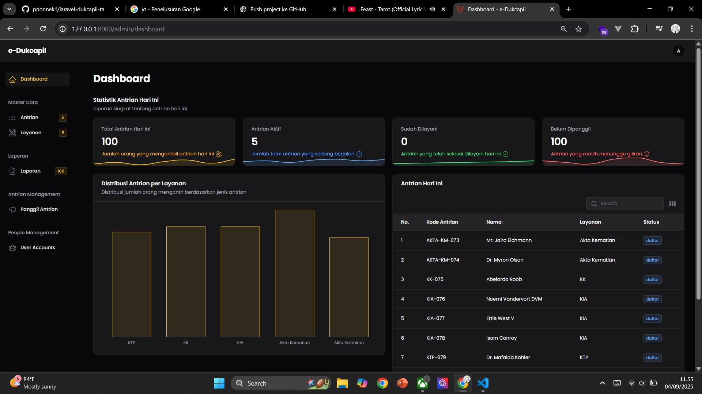

# Sistem Antrian Dukcapil

Aplikasi sistem antrian untuk Dinas Kependudukan dan Pencatatan Sipil (Dukcapil) yang dibangun menggunakan **Laravel 12** dengan integrasi **Filament Admin** sebagai dashboard administrator.  
Project ini dibuat untuk mempermudah pengelolaan antrian layanan masyarakat agar lebih teratur, transparan, dan efisien.

---

## 🚀 Fitur Utama
- Pendaftaran antrian secara online.
- Nomor antrian otomatis.
- Pemanggilan antrian real-time.
- Dashboard admin dengan **Filament**:
  - Manajemen data antrian.
  - Monitoring statistik harian.
  - Manajemen user (petugas/admin).
- Riwayat antrian dan laporan.

---

## 🛠️ Teknologi yang Digunakan
- [Laravel 12](https://laravel.com/) - Framework utama.
- [Filament Admin](https://filamentphp.com/) - Dashboard admin.
- MySQL / MariaDB - Database.
- Bootstrap / Tailwind - Frontend styling.
- Livewire - Komunikasi real-time.

---
## 📸 Screenshot
### Halaman dashboad user

### Halaman ambil antrian

### Halaman lihat antrian

### Dashboard Admin (Filament)

### Dashboard Admin panggil antrian (Filament)

